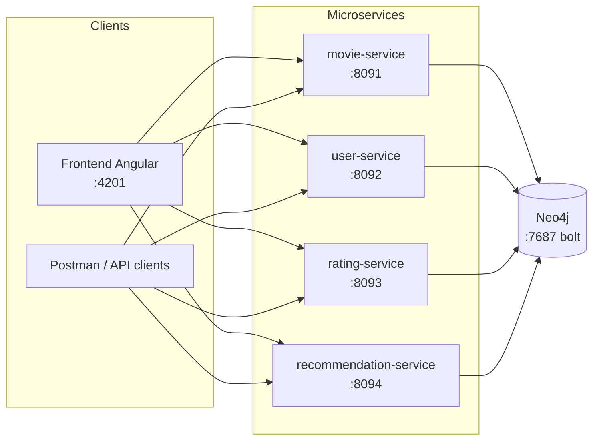

# Architecture

## Vue d'ensemble

Quatre microservices Spring Boot indépendants (build, déploiement, JAR séparés),
qui partagent **une seule base Neo4j**. Chaque service a son propre port et son
propre repo/JAR mais ils lisent/écrivent tous dans le même graphe.

## Pourquoi une base Neo4j partagée plutôt qu'une base par service

En microservices "classique" (REST + SQL), la règle est en général "une base par
service, communication uniquement par API". Ici on s'en écarte volontairement,
pour deux raisons concrètes à ce projet :

1. **Les recommandations et le calcul de moyenne ont besoin de traverser des
   relations qui touchent plusieurs "domaines" à la fois** (`User`-[:RATED]->`Movie`).
   Si chaque service avait sa propre base, calculer une simple moyenne de notes
   obligerait rating-service à interroger movie-service par API à chaque écriture,
   et le recommendation-service à interroger les deux pour chaque calcul. Ça
   ajoute de la latence et de la complexité sans bénéfice réel ici.
2. **L'audit du projet demande explicitement un graphe unifié** représentant
   movies/users/ratings avec leurs relations (voir `docs/neo4flix-audit.md`,
   section "Data and Design").

Le compromis : on perd l'isolation stricte des bases, donc on **doit** se
discipliner sur qui a le droit d'écrire quoi. C'est la règle ci-dessous, et
`03-neo4j-concepts.md` explique comment on l'applique techniquement (OGM vs
Neo4jClient).

## Qui possède quoi (bounded context)

| Nœud / relation | Propriétaire (écriture) | Lecture par d'autres services |
|---|---|---|
| `Movie`, `Genre` | movie-service | rating-service (lecture pour valider), recommendation-service |
| `Movie.averageRating` | rating-service (seule exception : une propriété de `Movie` que movie-service ne touche jamais) | tous en lecture |
| `User` | user-service | rating-service (lecture pour valider) |
| `RATED` (User→Movie) | rating-service | recommendation-service, movie-service (lecture) |
| `WANTS_TO_WATCH` (User→Movie) | user-service | — |

**Règle appliquée dans le code** : un service ne mappe en entité Spring Data
Neo4j (OGM, `@Node`/`@Relationship`) *que* les nœuds qu'il possède. Pour toute
opération qui touche un nœud possédé par un autre service (ex : rating-service
qui doit vérifier qu'un `Movie` existe, ou lier un `User` à un `Movie` via
`RATED`), on passe par `Neo4jClient` avec du Cypher explicite plutôt que par une
relation OGM mappée sur l'agrégat. Voir `03-neo4j-concepts.md` pour le pourquoi
technique précis (risque de `save()` en cascade qui écraserait des données
d'un autre service).

## Ports

| Service | Port |
|---|---|
| Neo4j Browser | 7474 |
| Neo4j Bolt | 7687 |
| movie-service | 8091 |
| user-service | 8092 |
| rating-service | 8093 |
| recommendation-service | 8094 |
| Frontend Angular | 4201 |

Ces valeurs ont été choisies pour éviter les ports déjà occupés par d'autres
projets en cours sur les machines de dev de l'équipe (Jenkins, Nexus, Angular
d'un autre projet, etc. tournent souvent sur 8080-8085 et 4200).

## Déploiement Docker

Chaque microservice a son propre `Dockerfile` (build multi-stage : JDK pour
compiler avec `mvnw`, JRE pour l'exécution — image finale plus légère). Le
frontend a le même principe avec Node pour builder et nginx pour servir le
résultat statique (avec un fallback `try_files` vers `index.html` pour que le
routing Angular côté client fonctionne sur un refresh/lien direct).

`backend/docker-compose.yml` orchestre tout : Neo4j démarre en premier (avec un
`healthcheck` cypher-shell), les 4 microservices attendent qu'il soit prêt, puis
le frontend. Un seul `docker compose up -d --build` depuis `backend/` lance
l'application complète — voir `00-getting-started.md`.

Les microservices lisent `NEO4J_URI` et `JWT_SECRET` depuis l'environnement (avec
un défaut `localhost`/valeur de dev codée en dur si la variable n'est pas définie),
ce qui permet au même jar de tourner identiquement en local (`mvnw spring-boot:run`)
ou en conteneur (où `NEO4J_URI` vaut `bolt://neo4j:7687` — `neo4j` est résolu par
le DNS interne de Docker vers le conteneur `neo4flix_db`, `localhost` à l'intérieur
d'un conteneur ne fonctionnerait pas).

### CORS

Le frontend (`http://localhost:4201`) et chaque microservice sont sur des ports
différents → origines différentes pour le navigateur → sans CORS explicite, toutes
les requêtes fetch du frontend seraient bloquées. Les 4 services autorisent
explicitement l'origine `http://localhost:4201` via un bean
`CorsConfigurationSource` branché sur leur `SecurityFilterChain` (`.cors(...)`),
plus un `permitAll()` explicite sur les requêtes `OPTIONS` (le pré-vol CORS du
navigateur n'envoie jamais le header `Authorization`, donc sans ce `permitAll`
il serait rejeté avant même d'atteindre le contrôleur).

## Sécurité inter-services

Un seul service (user-service) émet des JWT. Les 3 autres (movie-service,
rating-service, recommendation-service) le valident avec le même secret HMAC
partagé, sans jamais appeler user-service pour vérifier un token. Détail
complet dans `04-security.md`.

**movie-service est le seul des 4 avec des routes publiques** : lire le
catalogue (`GET /api/movies`, `/api/movies/{id}`, `/api/movies/search`,
`/api/genres`) ne demande pas de compte, exprès (parcourir un catalogue de
films n'a pas besoin d'authentification). Créer/modifier/supprimer un film
(`POST`/`PUT`/`DELETE /api/movies`) exige en revanche un JWT portant
`ROLE_ADMIN` dans ses claims — voir `SecurityConfig.securityFilterChain()`
dans movie-service et `04-security.md` pour comment un compte devient admin
(pas de self-service : l'inscription n'assigne jamais que `ROLE_USER`).
